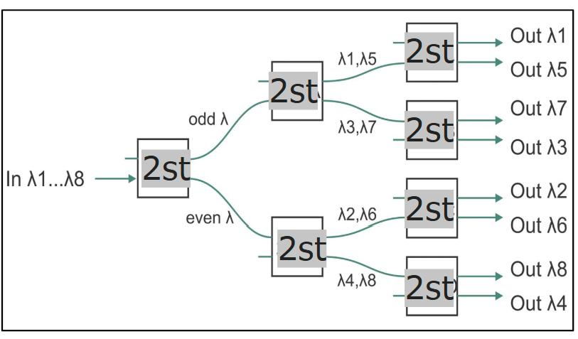
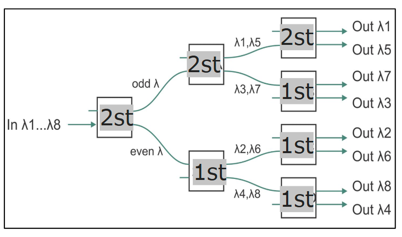
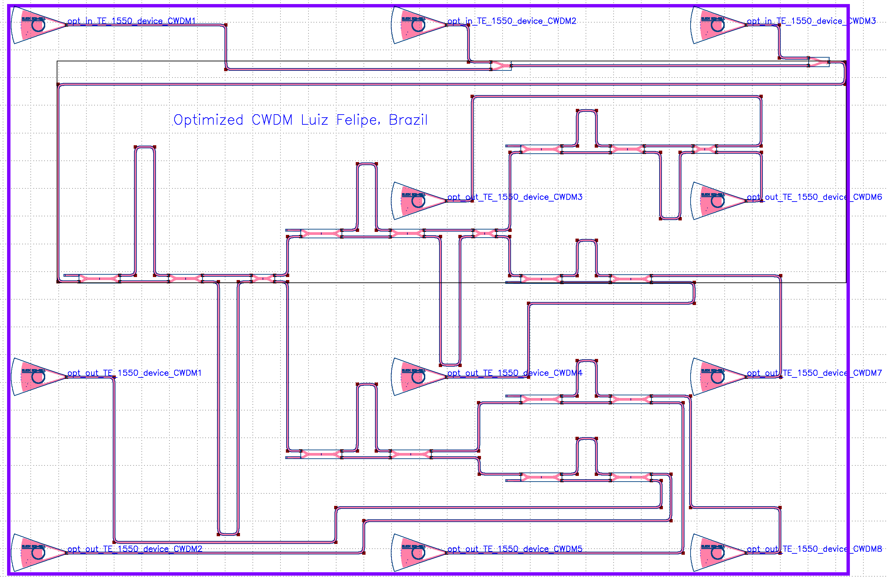
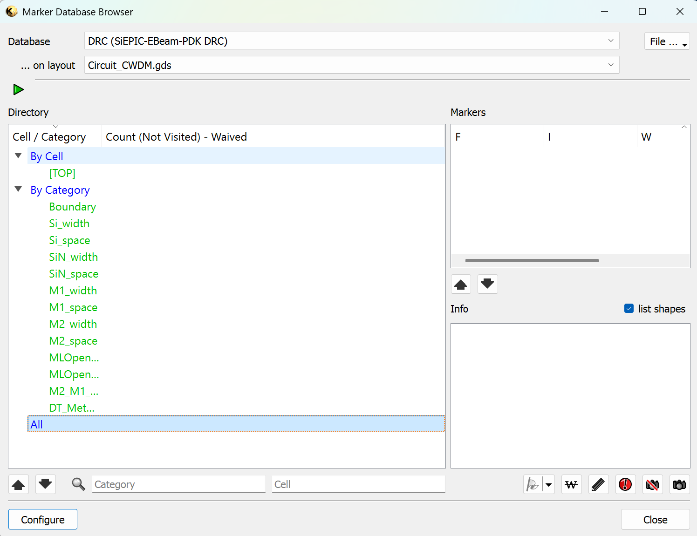

# CWDM Klayout

## CWDM 200 GHz - Circuito Original

   
  <em>Figura 1 - Ordem dos Filtros Utilizados.</em>

   
  <em>Figura 2 - Resultados CWDM 200GHz - Circuito Original.</em>

## CWDM 200 GHz - Circuito Otimizado

**Para diminuir as perdas do circuito e equalizar as saídas dos canais, tem-se o seguinte circuito:**

   
  <em>Figura 3 - Ordem dos Filtros Utilizados.</em>

   
  <em>Figura 4 - Resultados CWDM 200GHz - Circuito Otimizado.</em>

**Nota-se a partir da Figura 4 que o circuito otimizado possui uma perda de inserção menor, bem como os canais estão equalizados.**

## Etapa Klayout

   
  <em>Figura 5 - Design do Filtro Otimizado no Klayout.</em>

   
  <em>Figura 6 - Verificação de erros por meio do DRC.</em>

